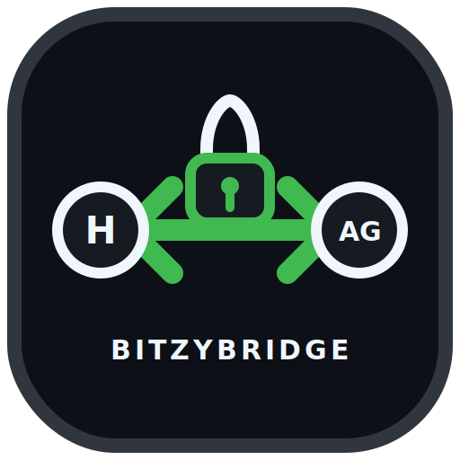

<p align="center">
  
</p>

<h1 align="center">BitzyBridge-AG</h1>

<p align="center">
  <strong>Secure remote control and human-in-the-loop approvals for Antigravity through Hermes Agent.</strong>
</p>

<p align="center">
  <a href="https://github.com/features/actions"></a>
  
  
  
  <a href="LICENSE"></a>
</p>

<p align="center">
  <a href="https://paypal.me/bitzyid"></a>
</p>

---

## The bridge

BitzyBridge-AG connects a Telegram operator to the active Antigravity desktop conversation without exposing Antigravity's CDP endpoint beyond loopback.

```text
┌──────────┐       ┌──────────────┐       ┌────────────────┐       ┌─────────────┐
│ Telegram │  ⇄    │ Hermes Agent │  ⇄    │ BitzyBridge-AG │  ⇄    │ Antigravity │
└──────────┘       └──────────────┘       │ plugin+watcher │       └─────────────┘
                                          └────────────────┘         127.0.0.1 CDP
```

It can send a task, inspect status, stop an active run, and relay permission prompts for an explicit human decision.

> **Plugin + companion skill.** The plugin provides the control tool, `/bitzy` chat command, and gateway hook. The skill teaches Hermes when and how to use that surface safely. A companion systemd watcher handles CDP discovery, approvals, audit state, and restart recovery.

## Highlights

| Capability | Behavior |
|---|---|
| Remote task control | Targets exactly one verified Antigravity conversation |
| Live status | Reports idle/busy state and recent visible output |
| Stop control | Stops only the matched active conversation |
| Chat menu + skill | Adds `/bitzy` and installs the `bitzybridge-ag` workflow skill |
| Telegram approvals | Allow once, allow project, always allow, or deny |
| Replay resistance | Single-use nonce, TTL, sender binding, and prompt fingerprint |
| Restart recovery | Rediscovers loopback CDP and restores valid pending requests |
| Safe updates | Preserves private config, creates backups, and rolls back failed deployment |
| Audit trail | Owner-only state files and append-only decision records |

## Requirements

- Linux with systemd user services
- [Hermes Agent](https://hermes-agent.nousresearch.com/docs) with Telegram configured
- Antigravity desktop with its local loopback CDP endpoint available
- Python 3.11+ with either `uv` or the standard `venv` module

## One-shot install

```bash
git clone <REPOSITORY_URL> BitzyBridge-AG
cd BitzyBridge-AG
./install.sh
```

The installer checks prerequisites, reuses the Telegram bot token from Hermes when available, asks for the authorized Telegram user ID, creates an isolated Python environment, installs the plugin and watcher, restarts Hermes, and runs verification.

For a Telegram DM, the chat ID defaults to the authorized user ID. The token is entered without echo and is never printed by the installer.

### Unattended install

```bash
TELEGRAM_BOT_TOKEN="YOUR_BOT_TOKEN" \
AG_TELEGRAM_USER_ID="YOUR_USER_ID" \
AG_TELEGRAM_CHAT_ID="YOUR_CHAT_ID" \
./install.sh --non-interactive
```

Use `./install.sh --offline-check` when Antigravity is not running yet. Existing private configuration, plugin, skill, and service are backed up and restored if an update fails.

> Use the root installer rather than `hermes plugins install` by itself. The companion Python environment and systemd watcher also need to be configured.

## Hermes tool

The plugin registers one deliberately small control surface:

```json
{"action":"status"}
{"action":"send","expected_conversation":"my-project","task":"Fix the failing test"}
{"action":"stop","expected_conversation":"my-project"}
```

`expected_conversation` is strongly recommended. Sending fails closed when the active conversation is ambiguous, busy, or already contains unsubmitted text.

## Chat menu and companion skill

The plugin registers a discoverable `/bitzy` command in Hermes gateway sessions and the installer adds the `bitzybridge-ag` skill:

```text
/bitzy
/bitzy status
/bitzy send Exact Conversation Title :: Fix the failing tests
/bitzy stop Exact Conversation Title
/skill bitzybridge-ag
```

Selecting `/bitzy` from Telegram's command menu displays usage and copy-ready examples. `status`, `send`, and `stop` can run directly without an LLM turn. Natural-language requests such as “ask Antigravity to fix the tests” use the companion skill and the same fail-closed control tool.

## Approval contract

Telegram decisions carry a short nonce and an exact choice label:

```text
AG A1B2C3 · 1 Allow once
AG A1B2C3 · 2 Allow project
AG A1B2C3 · 3 Always allow
AG A1B2C3 · 4 Deny
```

A decision is accepted only when all of these match:

- nonce and exact choice label
- authorized Telegram chat and user
- unexpired request TTL
- current live prompt fingerprint
- an unused pending request

The bundled policy defaults to `remote-confirm` with no automatic allow roots. Global **Always allow** is never selected automatically.

## Security boundaries

- CDP discovery and connections are restricted to `127.0.0.1`.
- Ambiguous windows, conversations, prompts, and sender identities fail closed.
- Credentials live outside the repository in `~/.config/bitzybridge-ag/env` with mode `0600`.
- Runtime state lives outside the plugin under `~/.cache/bitzybridge-ag`.
- Failed updates restore the previous plugin and service; failed artifacts remain available as evidence.

Read the full policy in [SECURITY.md](SECURITY.md) and the component flow in [docs/architecture.md](docs/architecture.md).

## Development

```bash
python3 -m unittest discover -v -s tests
python3 -m compileall -q .
python3 scripts/source_hygiene.py .
./scripts/doctor.sh --offline
```

This repository is the source of truth. Make and test changes here first; treat the installed Hermes plugin as a deployment target.

## Support the project

If BitzyBridge-AG saves you time, support continued maintenance:

<p align="left">
  <a href="https://paypal.me/bitzyid"></a>
</p>

## License

Released under the [MIT License](LICENSE).
